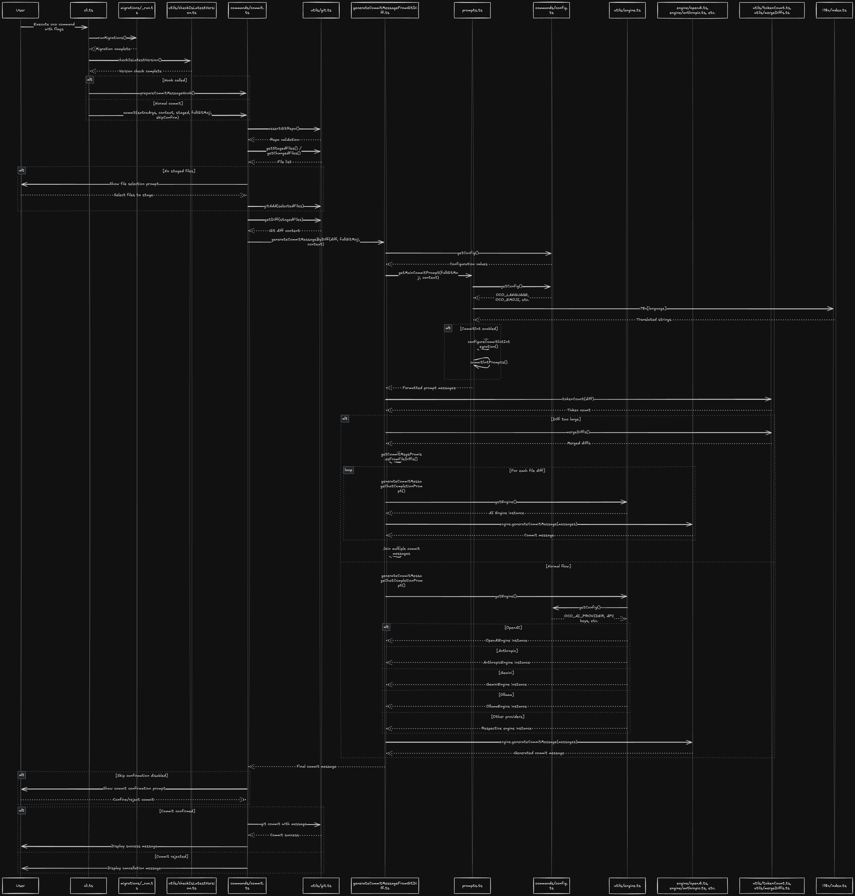

# 🚧 Forking a repo and making changes for dummies 👩‍🏫

This guide explains how to fork, modify, and test your changes to a forked npm package in another local project.

---

## 🛠️ Setup Steps

1. **Fork the Repository**
   - Go to GitHub and fork the original repo.

2. **Clone Your Fork**
   ```bash
   git clone https://github.com/<your-username>/<your-repo-name>.git
   cd <your-repo-name>
   ```
    For this project I chose the name `opencommit-with-jira-issue-scope`.

3. **Install Dependencies**
   ```bash
   npm install
   ```

4. **Change the Package Name**
   - Edit `package.json` and set:
     ```json
     "name": "opencommit-with-jira-issue-scope"
     ```

5. **Make Your Changes**
   - Edit the code as needed.

6. **Build the Project**
   ```bash
   npm run build
   ```

7. **Link the Package Globally**
   ```bash
   npm link
   ```
   > This makes your local package available globally for testing.

---

## 🚀 Test in Another Project

1. **Go to Your Other Project Folder**
   ```bash
   cd /path/to/your/other/project
   ```

2. **Link to Your Local Package**
   ```bash
   npm link opencommit-with-jira-issue-scope
   ```

3. **Run the CLI to Test Changes**
   ```bash
   oco
   ```
   > The `oco` command will use your local changes.

---

## 🔄 Workflow for Future Changes

- After making changes in your library, **just run:**
  ```bash
  npm run build
  ```
  > No need to re-link unless you change the package name.

---

## ⚙️ Optional: Change Default Variables

- Edit your configuration file:
  ```bash
  open ~/.opencommit
  ```

---
## 📝 Key Components Overview



### **Entry Points:**
- **cli.ts**: Main entry point, parses CLI arguments and routes to appropriate commands
- **commands/commit.ts**: Handles the commit generation workflow

### **Core Logic:**
- **generateCommitMessageFromGitDiff.ts**: Main business logic for generating commit messages
- **prompts.ts**: Builds AI prompts with context, language support, and commit conventions

### **AI Integration:**
- **utils/engine.ts**: Factory for creating AI provider instances
- **engine/*.ts**: Individual AI provider implementations (OpenAI, Anthropic, Gemini, etc.)

### **Utilities:**
- **utils/git.ts**: Git operations (staging, diff generation, commits)
- **utils/tokenCount.ts**: Token counting for AI model limits
- **utils/mergeDiffs.ts**: Diff optimization for large changes

### **Configuration:**
- **commands/config.ts**: Configuration management
- **i18n/**: Internationalization support

### **Flow Highlights:**
1. CLI parses arguments and runs migrations/version checks
2. Commit command validates git repo and gets staged/changed files
3. Git diff is generated and passed to the commit message generator
4. Prompts are built with context, language, and conventions
5. AI engine processes the prompt and returns a commit message
6. User confirms and the commit is executed
